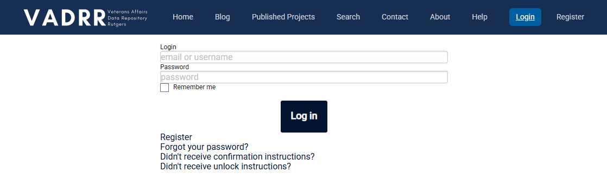

# (PART) Navigating VADRR {-}

# Getting Started {#start}

---

The first thing you’ll need to do to get started is register for VADRR.

This is very easy (and did we mention free?). Go to the [VADRR website](https://vadrr.org/users/sign_in) and simply click on the Register link, enter your email and a password.

  

That’s all it takes! Now you are ready to begin setting up your project and creating your data extraction template.

